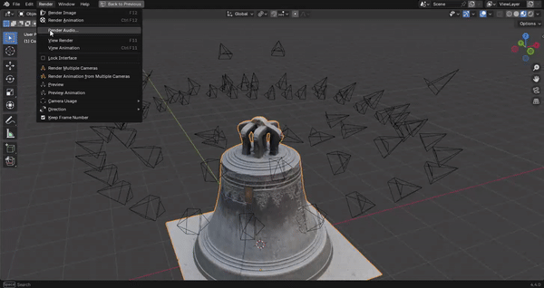

<!-- SPDX-FileCopyrightText: 2025 Ivan Perevala <ivan95perevala@gmail.com>

SPDX-License-Identifier: GPL-3.0-or-later -->

# Multiple Camera Render

Extension for [Blender](https://www.blender.org/) for sequential rendering from multiple cameras.

The addon was created for prototyping photogrammetric, photometric or volumetric captures of multiple-camera rigs.

It enables quick simulation of not only the location of the cameras, but also the selection of the desired lens, reproduction of inaccuracies from the real world (lens distortion, depth of field, chromatic aberration, etc.). That is, you can set up a scene and create a synthetic dataset for testing in your photogrammetry software.

Obviously, the addon can be used not only for these purposes, but also with any scenes where you need to render from several different cameras - this is also a good use case for it. 

An example of use can be the creation of render proxy [impostors](https://docs.unrealengine.com/en-US/Engine/Content/Tools/RenderToTextureTools/3/index.html) for Unreal or Unity.

## Release Notes

* [Version 4.4.0 (latest)](./release/notes/v4.4.0.md)
* [Version 3.0.0](./release/notes/v3.0.0.md)

## License

Copyright © 2020-2025 Vladlen Kuzmin (ssh4), Ivan Perevala (ivpe).
