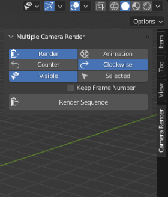
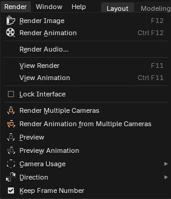
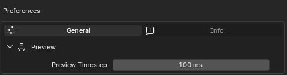

# Multiple Camera Render 4.4.0 Release Notes

> [!IMPORTANT]
> This release changes the way extension works.

* **Compatibility** with Blender 4.2+ series extensions (see: [Blender Manual Page](https://docs.blender.org/manual/en/latest/editors/preferences/addons.html))

* **Complete rewrite of addon internal logic**. Previous versions used manipulations with frame ranges, which worked just fine for static scenes but was not suitable for any animations. This update works just how it supposed to be:
  - For sequential rendering current frame would be rendered multiple times from different cameras.
  - Animations would be rendered in existing frame range multiple times, also from multiple cameras sequentionally.

  This was done in a bit more complicated way - by combination of application handlers and modal operator. Also implemented Clockwise iterator algorithm which uses ``numpy`` array instead of list for faster camera sequence iteration.

  Those changes should not change existing workflows, but opens a lot of new ways of using the addon.

* **Preview Mode**
  
  Now there is a possibility to see what the addon would actually do, without rendering, both for sequential image rendering and animation.

  

  The addon would not interrupt user input, so you can navigate through the scene, and see output file path evaluation. If you need to stop preview, press ``Esc`` button or cancel animation playback.

* **Functional tests**. A completely automated way to test Multiple Camera Render functionality on newer Blender versions. What is tested:
  - Render and animation from multiple cameras.
  - Preview of camera order, for animation as well.
  
  All tests are running for UI and background modes. To run them you need to create [Python virtual environment](https://docs.python.org/3/library/venv.html) with [pytest](https://docs.pytest.org/en/stable/) installed and run ``pytest`` command from project root directory. Also make sure that Blender is available on system PATH and addon is installed.

  Tested Blender versions at this moment are: `4.5`, `4.4`, `4.3`, `4.2`

> [!NOTE]
> See [tests/README.md](../../tests/README.md) file for more details.

* **Background mode compatibility**. Usefull for automation. This functionality might be used from command line: 
  ```powershell
  blender ring.blend --background --python-expr "import bpy; bpy.ops.mcr.render('INVOKE_DEFAULT', animation=True)"
  ```

  More information about rendering from command line might by found on [Rendering From The Command Line (Blender Manual)](https://docs.blender.org/manual/en/latest/advanced/command_line/render.html).

* **User Interface updated**.

  - All the functionality has been moved from ``ToolBar`` > ``Camera Render`` to ``Topbar`` > ``Render``:

  <p align="center">
    <tr>
      
      
    </tr>
  </p>

  - Updated user preferences:

    - Added progress bar in right corner of status bar, indicating rendering progress.

    - Added option for preview mode camera update time step:
  
      

    - Logging options (available if [Blender Development Extras](https://docs.blender.org/manual/en/4.4/editors/preferences/interface.html?utm_source=blender-4.4.0#bpy-types-preferencesview-show-developer-ui) enabled):

      

